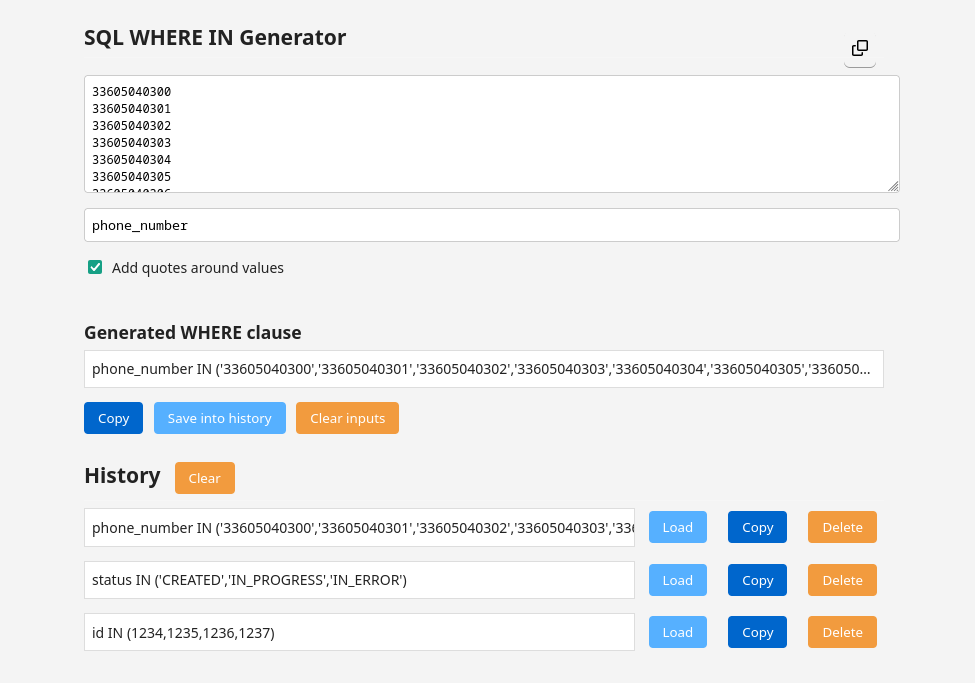

# SQL WHERE IN Generator

> https://benbb96.github.io/sql-where-in-generator/

You can use this web app to generates a SQL WHERE IN clause based on an input of text and copy the output to your clipboard.

You can also save your generated clauses into history (not stored in localStorage).

